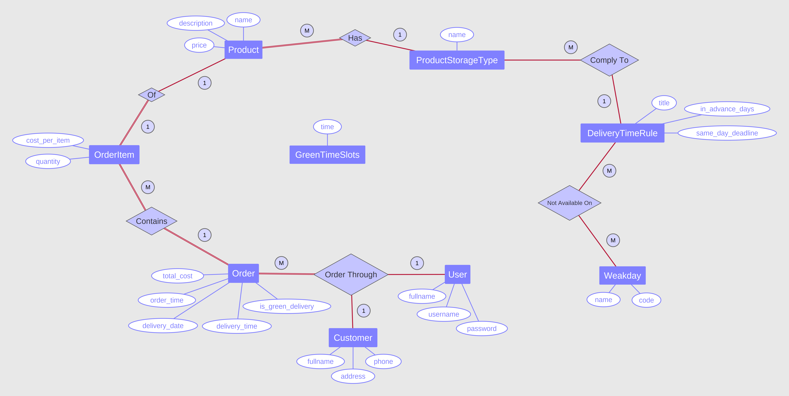
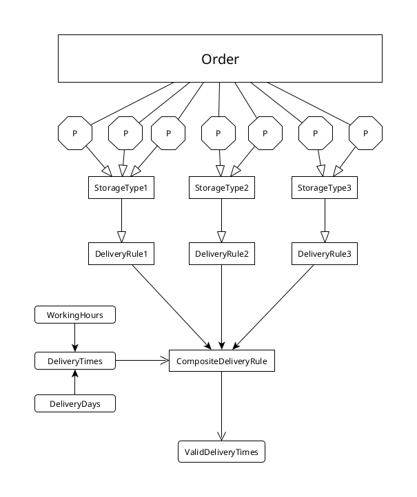

<h1 style="text-align: center">Grocery Back-Office API</h1>

## Table of Contents

- [Installation](#installation)
- [Design](#design)
- [Delivery Time Rules Composition](#delivery-time-rules-composition)

## Installation

To install and run the Grocery Back-Office API, follow these steps:
1. Clone the repository:

```bash
git clone https://github.com/Mohammed4mach/grocery-back-office-api.git
```

2. Initialize the project (using [GNU Make](https://www.gnu.org/software/make/#download))

```bash
make project
```

3. Run the server

```bash
make
```

or use

```bash
dotnet run watch
```

## Design

Here is the design for my solution to the problem

<p align="center">
    <a href="assets/diagrams/ERD.png">
        
    </a>
</p>

The idea is to avoid hard-coding product categories and thier time constraints.
This is better for users and developers, as business needs and policies tends
to change or be extended over the time.

## Delivery Time Rules Composition

The core problem here is to give a valid delivery date and time, which is
constrained by delivery time rules on the storage types. A brute-force solution
will works fine, as the working hours and the maximum number of days to
order in advance are not too large in number.
do the job.

However, an elegant, dynamic, and more reliable solution is to compose one
rule from the set of rules that apply on products of the order. This
comprehensive rule should satisfy all constraints that are defined by rules
it composed from. Then all time slots - included in working hours - and all
14 days pass will be filtered according to constrained set by the composite
rule. This logic can be found in
<a href="src/App/Services/DeliveryTimeService.fs">DeliveryTimeService</a>
and
<a href="src/App/Services/DeliveryTimeRuleService.fs">DeliveryTimeRuleService</a>.

<p align="center">
    <a href="assets/diagrams/delivery-rule-composition-flow-diagram.png">
        
    </a>
</p>

